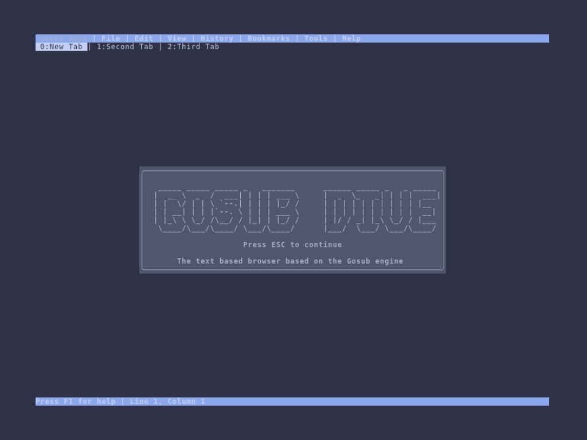

# Gosub Dive - A proof of concept textual browser based on the Gosub Engine

This repository is part of the Gosub browser project.

Join us at our development [Zulip chat](https://chat.developer.gosub.io)!

For more general information you can also join our [Discord server](https://chat.gosub.io).

If you are interested in contributing to Gosub, please checkout the [contribution guide](CONTRIBUTING.md)!

## About
This repository contains the source code for the Gosub Dive browser. Dive is a proof of concept textual browser based on the Gosub Engine.
This browser is written in Rust and uses the Ratatui library for the terminal interface.

As long as you don't expect things to work, you'll be fine.